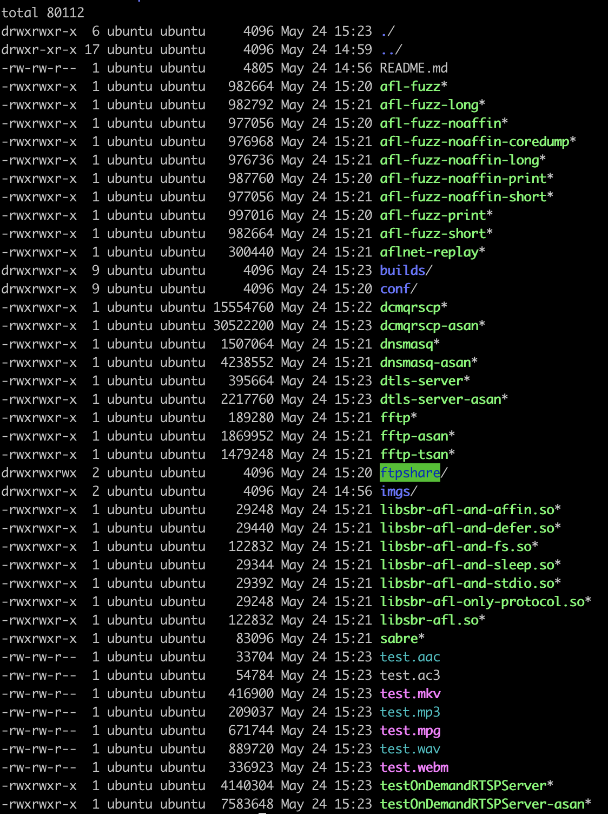
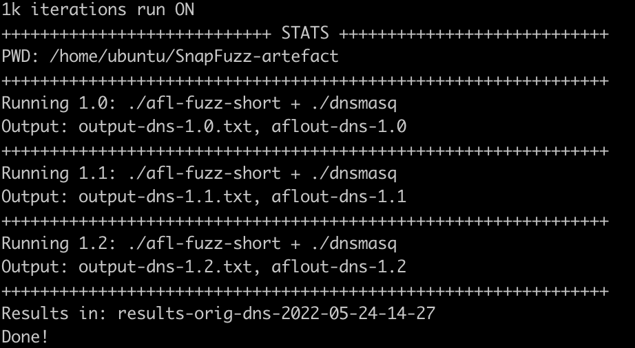
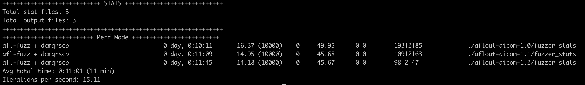

# SnapFuzz Artefact

## IMPORTANT

- All commands should be run from inside the root directory that this `README.md` file exists!
- We highly suggest using `screen` for all experiment runs.
- Don't run scripts in parallel. This artifact is explicitly serial.
- We expect some variations on performance numbers and we remind the reader that our performance numbers were obtained on a bare-metal machine with a `3.0 GHz AMD EPYC 7302P 16-Core CPU` and `128 GB RAM`, running `64-bit Ubuntu 18.04 LTS (kernel version 4.15.0-162)` with an `SSD disk`. If the experiments are to be conducted inside a container or a virtual machine, performance variations are expected.

## Setup

1. Run `./conf/config.sh`
1. Run `./conf/build.sh`

Make sure that both scripts finish with the message `Done!` in the end. You can also validate that everything worked properly by running `echo $?` after every script. If the return value is `0`, you are ready to proceed.

After both scripts are executed, the SnapFuzz root directory should include the following files:

## Make preliminary test runs of the AFLNet baseline and SnapFuzz experiments

Before we generate the real benchmark data, we can run some preliminary numbers just to make sure everything works properly. There are two main scripts:

1. `./conf/run-orig.sh` that launches the native AFLNet experiments
1. `./conf/run-snapfuzz.sh` that launchers the SnapFuze experiments

To make some tests runs of 1,000 iterations that last only but a short period of time, use the following commands:

1. `./conf/run-orig.sh -s dicom`
1. `./conf/run-orig.sh -s dns`
1. `./conf/run-orig.sh -s dtls`
1. `./conf/run-orig.sh -s ftp`
1. `./conf/run-orig.sh -s rtsp`

Make sure that each command has run successfully by verifying that a new directory under the name schema of `results-orig-{project name}-{date}` has been created.

In the following image you can see a successful run of the `dns` benchmark:

**NOTE: Our run scripts perform some checks after each run but if something feels off, you can inspect the `results-orig-{project name}-{date}/output-{project name}-{iteration}.txt` file for errors.**

The same goes for the SnapFuzz experiments:

1. `./conf/run-snapfuzz.sh -s dicom`
1. `./conf/run-snapfuzz.sh -s dns`
1. `./conf/run-snapfuzz.sh -s dtls`
1. `./conf/run-snapfuzz.sh -s ftp`
1. `./conf/run-snapfuzz.sh -s rtsp`

After the above runs are done, you should be able to see new directores under the name schema of `results-orig-{project name}-{date}` for the native AFLNet experiments and `results-snapfuzz-{project name}-{date}` for the SnapFuzz experiments.

You can `cd` in each of the directories and see the stats with:

1. `../conf/stats.py`

An example output is provided in the following picture. The only important information is the `Avg total time` line which provides explicit information on the average time required for one fuzzing campaign to execute. By collecting each average total time for each project and compairing them then with SnapFuzz, we can conclude on the total speedups reported in our paper.

## Run AFLNet baseline experiments

Now we are ready to generate the paper data. The baseline data include 1 milion iterations and we need to run each experiment seperately. Be warned that the actual baseline data are extremely slow and each iteration run will take a day or more. Nevertheless, to reproduce our results you run the following:

1. `./conf/run-orig.sh dicom`
1. `./conf/run-orig.sh dns`
1. `./conf/run-orig.sh dtls`
1. `./conf/run-orig.sh ftp`
1. `./conf/run-orig.sh rtsp`

## Run 1 milion iterations SnapFuzz experiments

The same goes for the SnapFuzz data. SnapFuzz is of course significantly faster and thus a couple of hours should be enough for each iteration. We follow a similar strategy as above:

1. `./conf/run-snapfuzz.sh dicom`
1. `./conf/run-snapfuzz.sh dns`
1. `./conf/run-snapfuzz.sh dtls`
1. `./conf/run-snapfuzz.sh ftp`
1. `./conf/run-snapfuzz.sh rtsp`

After the above runs are done, you should be able to see new directores under the name schema of `results-snapfuzz-{project_name}-{date}`. You can `cd` in each of the directories and see the stats with:

1. `../conf/stats.py`

## Run 24h SnapFuzz experiments

To generate the SnapFuzz data we follow a similar strategy as above:

1. `./conf/run-snapfuzz.sh -l dicom`
1. `./conf/run-snapfuzz.sh -l dns`
1. `./conf/run-snapfuzz.sh -l dtls`
1. `./conf/run-snapfuzz.sh -l ftp`
1. `./conf/run-snapfuzz.sh -l rtsp`

After the above runs are done, you should be able to see new directores under the name schema of `results-snapfuzz-{project_name}-{date}`. You can `cd` in each of the directories and see the stats with:

1. `../conf/stats.py`

**NOTE: The 24h results don't have any special directory indicator from the standard SnapFuzz results.**

## Result evaluation

After all `1 milion iterations` experiments are done, you can validate our speedup results reported in Table 1 in the paper by simply dividing the `Avg total time` reported by the `stats.py` for each baseline experiment with the corresponding SnapFuzz one.

As running our full suite of `1 milion iterations` is taking a very long time, the reviewers could sample our results with high confidence by just comparing the results from the `preliminary test runs`.
